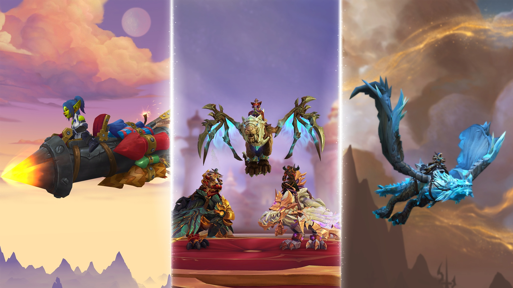

  

# wxl-modern-m2

**Loads models authored for newer versions of the game, natively.**

A [WarcraftXL](https://github.com/WarcraftXL/wxl-core) extension. The client's model loader only
understands the format it originally shipped with; a model authored later isn't rejected politely, it
simply can't be read at all. This module reads that newer file **directly** and fills the client's own
model runtime with it, with no conversion step, no intermediate copy on disk, and no version rewrite.
The model stays exactly what it is; the client just ends up holding it in the shape it always expected.

See [`store/description.md`](store/description.md) for the full write-up (what gets fixed on the way in,
what's intentionally out of scope for now, and the safety/interface contract).

## Highlights

- **Direct native read**: no more host-side pre-conversion
- **Record normalization**: particle emitters and cameras that grew wider over time are rewritten in
  place, driven by a small table (adding a new record type is one entry, not a new code path).
- **Bone-budget splitting**: rigs with more bones than the client can draw in one pass are partitioned
  into pieces that each fit, instead of silently clamped and deformed.
- **Shadow-camera fix**: detects and corrects the bone-flag combination that otherwise sends the shadow
  pass down a path that never refreshes the pose.
- **Effect and hit-test fixes**: particle/ribbon blending and triangle hit-testing corrected so effects
  render as intended and clicking selects the right thing.
- **Extended animation service**: resolves modern animation IDs against each model's available
  sequences, follows AnimationData fallbacks, and publishes `wxl.m2-animation` for movement modules.
- **Crash-safe**: malformed input is a logged failure, never a crash.

## Requirements

WarcraftXL on a 3.3.5a client, build 12340, plus
[`wxl-db2`](https://github.com/WarcraftXL/wxl-db2) 1.0.0 or newer for FileDataID resolution. The module
refuses to load against an incompatible client rather than guessing, and says so in the log.

`WXL_M2_EXTENDED_ANIMATIONS=1` in `wxl-modern-m2.cfg` enables the extended animation resolver and its
public service. It is enabled by default and can be disabled independently without disabling the
modern model loader.

## Building

This extension builds against [wxl-core](https://github.com/WarcraftXL/wxl-core) (branch `v1.1`), which
auto-discovers any folder dropped into its `extensions/` directory, so there's no project file of its own
needed here. See `.github/workflows/release.yml` for the exact steps; every push to `main` builds
the flat `wxl-modern-m2.dll` + `wxl-modern-m2.cfg` Hub package and publishes it as a release.

## License

GPL-3.0-or-later. See the license header in every source file.
